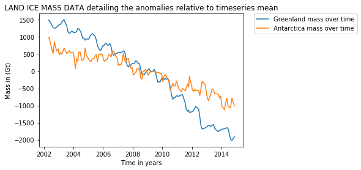
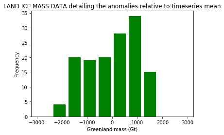

### Data Visualizations

```
File Directories:
```bash
|-- README.md
|-- LICENSE
|-- Basics
    |-- DSCN4601.JPG
    |-- facial_recognition.py
    |-- haarcascade_frontalface_default.xml
```
### Dataset Link
https://course-resources.minerva.kgi.edu/uploaded_files/mke/rx9A0n/s1-student-version--ea-assignment--climate-change--land-ice-mass-data---sheet1.csv

Basic data visualizations in Python
1. Line graph of LAND ICE MASS DATA detailing the anomalies relative to timeseries mean
2. Scatter plot of Greenland mass (Gt) against 'Antarctica mass (Gt)
3. Histogram of the frequency of Greenland mass (Gt)

```python
import pandas as pd
import matplotlib.pyplot as plt

url = 'https://course-resources.minerva.kgi.edu/uploaded_files/mke/rx9A0n/s1-student-version--ea-assignment--climate-change--land-ice-mass-data---sheet1.csv'
txt = "I need the caption to be present a little below X-axis"

df = pd.read_csv(url)[10:]
df = df.reset_index(drop=True)
df.columns = ['TIME (year.decimal fraction)','Greenland mass (Gt)','Antarctica mass (Gt)']
v1 = list(df['TIME (year.decimal fraction)'].values.astype(float))
v2 = list(df['Greenland mass (Gt)'].values.astype(float))
v3 = list(df['Antarctica mass (Gt)'].values.astype(float))

plt.plot(v1, v2, label = "Greenland mass over time")
plt.plot(v1, v3, label = "Antarctica mass over time")
plt.xlabel('Time in years') 
plt.ylabel('Mass in (Gt)')  
plt.title('LAND ICE MASS DATA detailing the anomalies relative to timeseries mean') 
plt.legend(bbox_to_anchor=(1.05, 1), loc='upper left', borderaxespad=0.)
plt.show()
```





```python
import pandas as pd
import matplotlib.pyplot as plt

url = 'https://course-resources.minerva.kgi.edu/uploaded_files/mke/rx9A0n/s1-student-version--ea-assignment--climate-change--land-ice-mass-data---sheet1.csv'

df = pd.read_csv(url)[10:]
df = df.reset_index(drop=True)
df.columns = ['TIME (year.decimal fraction)','Greenland mass (Gt)','Antarctica mass (Gt)']
v1 = list(df['Greenland mass (Gt)'].values.astype(float))
v2 = list(df['Antarctica mass (Gt)'].values.astype(float))

plt.scatter(v1, v2, label = "Greenland mass (Gt) against Antarctica mass (Gt)")
plt.xlabel('Greenland mass (Gt)') 
plt.ylabel('Antarctica mass (Gt)')  
plt.title('Scatter plot') 
plt.legend(loc='upper left')
plt.show()
```


```python
import pandas as pd
import matplotlib.pyplot as plt

url = 'https://course-resources.minerva.kgi.edu/uploaded_files/mke/rx9A0n/s1-student-version--ea-assignment--climate-change--land-ice-mass-data---sheet1.csv'

df = pd.read_csv(url)[10:]
df = df.reset_index(drop=True)
df.columns = ['TIME (year.decimal fraction)','Greenland mass (Gt)','Antarctica mass (Gt)']
v1 = list(df['Greenland mass (Gt)'].values.astype(float))

range = (-3000, 3000) 
bins = 10

plt.hist(v1, bins, range, color = 'green', histtype = 'bar', rwidth = 0.8)
plt.xlabel('Greenland mass (Gt)') 
plt.ylabel('Frequency')  
plt.title('LAND ICE MASS DATA detailing the anomalies relative to timeseries mean') 
plt.show()
```




